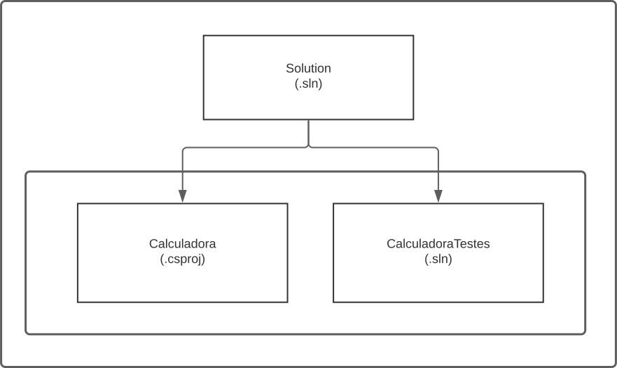

# DIO - Decola Tech 2024 - Testes Unitários
www.dio.me

## Projeto Testes Unitários com xUnit
Para este projeto, foi utilizado conhecimentos adquiridos no módulo de testes unitários, do bootcamp Decola Tech 2024 da DIO.

## Contexto
Aprender os principais conceitos de testes unitários, seu objetivo e sua importância em qualquer projeto, independente do seu tamanho.

## Vantagens
- A maior vantagem é a **qualidade**
- Garantir que alterações não tenha impactos no sistema
- Menos bugs
- Maior confiança de que suas classes e métodos funcionam
- Previnir problemas futuros

## Projeto Calculadora (Console)

### Tutorial para Iniciar e Executar o Projeto .NET Console:

### Passo 1: Criação do Projeto Console:
Dentro da pasta desejada abra o terminal e execute o seguinte comando para criar o projeto console:
~~~bash
dotnet new console -n Calculadora
~~~
Este comando criará um novo projeto chamado "Calculadora".

### Passo 2: Navegação para o Diretório do Projeto:
Mude para o diretório do projeto:
~~~bash
cd Calculadora
~~~

### Passo 3: Execução do Projeto:
Execute o projeto com o comando:
~~~bash
dotnet run
~~~
Isso deve exibir a saída padrão do aplicativo console de Calculadora.

## Projeto CalculadoraTestes (xUnit)

### Passo 1: Criação do Projeto xUnit:
Abra o terminal e execute o seguinte comando para criar o projeto xUnit:
~~~bash
dotnet new xunit -n CalculadoraTestes
~~~
Este comando cria um projeto xUnit chamado "MeuProjetoTeste".

### passo 2: Navegação para o Diretório do Projeto:
Mude para o diretório do projeto:
~~~bash
cd CalculadoraTestes
~~~

### Passo 3: Execução dos Testes:
Execute os testes com o comando:
~~~bash
dotnet test
~~~
O xUnit irá descobrir e executar todos os testes no seu projeto.

**- Lembre-se que toda vez é necessário ir para o diretorio do projeto que deseja executar.**
